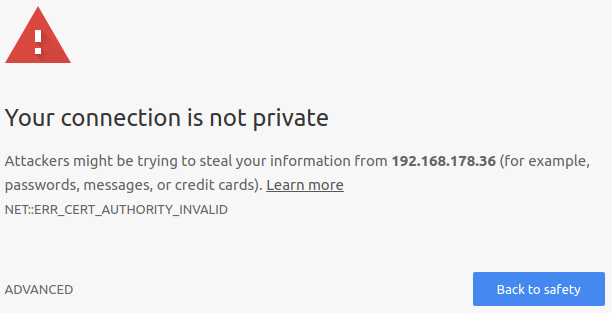

# Install ownCloud
The following steps describe how to set up **ownCloud** on a **Raspberry Pi 3 Model B**.

> **Note:** The **ownCloud** instance installed with the instructions below will be accessible through both https and
> http. https is preferred because it is the only reliable way to transmit sensitive data securely. However, security
> does have its cost, namely you have to perform a few extra steps during setup (like e.g. manually verify certificate
> fingerprints). If you don't care that much about security (e.g. because the data stored in **ownCloud** isn't
> sensitive or because you tightly control the network) you can just as well use http and avoid a few extra steps
> required for https.

## A. Install the OS
1. If you've purchased a kit that included a **microSD** card, then the card is likely preconfigured such that you can
   just insert the card into the **Raspberry Pi**. If you've purchased the card separately, you'll need to first
   download [NOOBS or NOOBS Lite](https://www.raspberrypi.org/downloads/noobs/) on another computer, copy it to the
   card and then insert the card into the **Raspberry Pi**.
2. Follow the instructions included with the **Raspberry Pi** to connect it to a monitor, a keyboard and a mouse.
3. Connect the power cable. Within moments the screen should come to live.
4. Follow the on-screen procedure to install **Raspbian** or **Raspbian Lite** and boot the freshly installed OS.  

## B. Customize Raspbian
1. If you haven't already done so during OS installation, you should now connect the **Raspberry Pi** to a network. This
   can either be done with a network cable or by joining a WLAN (click on the network icon in the top-right corner).
2. On **Raspbian**, open a terminal window (**Raspbian Lite** boots directly to the command line).
3. `sudo apt-get install git --assume-yes`
4. `git clone https://github.com/andreashuber69/owncloud`
5. `cd owncloud`
6. `./setup1` (this will reboot the **Raspberry Pi** when everything is done)

## C. Install ownCloud
1. On **Raspbian**, open a terminal window (**Raspbian Lite** boots directly to the command line).
2. `cd owncloud`
3. `./setup2` (prompts for the credentials for the **ownCloud** administrator)
4. Wait for the script to finish. If everything went smoothly, then you should see
   `ownCloud installation completed successfully.`.
5. Leave the terminal window open, we'll need it again in the next steps.

## D. Install ownCloud Contacts and Tasks Apps
1. Direct your browser to *https://[Raspberry Pi IP address]/owncloud* (on **Raspbian** the script does this
   automatically). The very first time you do this, the browser will show you a warning like the following:
   
   
2. While showing the warning, most browsers will also display warning icons in their address bar. Here's how this
   looks in **Chromium**:

   

   You can now click on **Not Secure** and then proceed to show the certificate, which will contain the SHA-1
   fingerprint.

   > Note: The version of **Chromium** that currently ships with **Raspbian** makes this a more complicated than
   > necessary as the certificate cannot be displayed by default. You first have to navigate to
   > *chrome://flags/#show-cert-link* in a separate tab and then click **Enable** and **RELAUNCH NOW**. After the
   > browser has restarted you can finally click on **Not Secure** and then display the certificate.
3. Verify the SHA-1 fingerprint shown by the browser is the same as the one that has been displayed in the terminal
   window.
4. If the fingerprints match, close the certificate window and click **ADVANCED** and **Proceed to .... (unsafe)**.
   The procedure varies slightly depending on your browser. The next time you direct your browser to the same address
   it will no longer display the warning but you will likely still see the red icons in the address bar. See
   [F](#f-display-certificate-fingerprint-on-raspbian) for more information.
5. Enter the credentials you provided under [C](#c-install-owncloud).
6. Click the menu icon in the top left corner and click **Market**.
7. Click the **Productivity** category and the **Contacts** app.
8. Click **Install** in the bottom right corner.
9. Click the **Productivity** category and the **Tasks** app.
10. Click **Install** in the bottom right corner.
11. If you plan on hosting your calendar in **ownCloud**, you can install that app too. Note however that I've not
    tested this in any way.

## E. Add ownCloud Users
1. Direct your browser to *https://[Raspberry Pi IP address]/owncloud*.
2. If not already logged in, log into ownCloud with the credentials you provided under [C](#c-install-owncloud).
3. In the top right corner, click on the admin user name and **Users**.
4. On the **Users** page, create a separate user for each person who needs to have access (it is recommended to only
   use the **ownCloud** administrator to create other users, not for anything else).
5. In the top right corner, click on the admin user name and **Logout**.

## F. Display Certificate Fingerprint on Raspbian
When SSL is activated in **Apache**, a self-signed certificate is generated. By default, **Apache** presents this
certificate whenever it receives a https connection request. However, since the certificate is not signed by a
certification authority (CA) like e.g. **Verisign**, the client (e.g. a browser) cannot verify that it did get the
correct certificate. This has to be done manually, by comparing the fingerprint of the received certificate with the one
of the certificate on the server. If the terminal window you've opened under [C](#c-install-owncloud) is still open,
you can skip the following steps, otherwise here's how the fingerprint can be displayed again on the **Raspberry Pi**:
1. On **Raspbian**, open a terminal window (**Raspbian Lite** boots directly to the command line).
2. `openssl x509 -in /etc/ssl/certs/ssl-cert-snakeoil.pem -noout -sha1 -fingerprint`

## G. Next Steps
Now that the centerpiece is set up, we can proceed to connect devices to it. It is advisable however, that you first
make yourself familiar with the backup and restore process.

- [Backup](backup.md)
- [Restore](restore.md)
- [Sync Files (Android)](sync-files-android.md)
- [Sync Files (Windows & Ubuntu)](sync-files-desktop.md)
- Import Contacts (instructions follow)
- [Sync Contacts and Tasks (Android)](sync-contacts-and-tasks-android.md)
